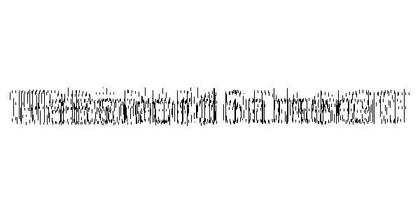
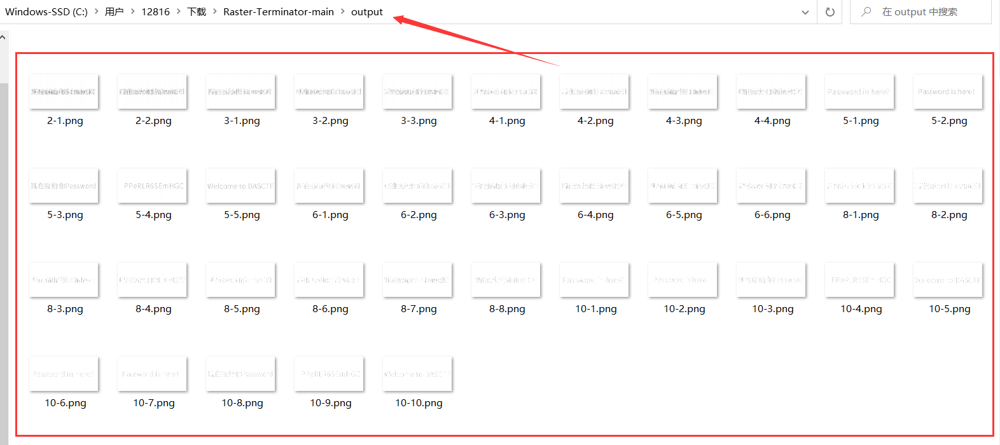

# Raster-Terminator
## 一款CTFer专属的光栅图碰撞全自动化脚本

## 1#关于该项目
在我们日常的CTF比赛中，有时候会碰到光栅图的相关隐写（对，我就碰到了），感谢 `@Phantom Engage` 和 `@daiowjfoaejoi` 两位师傅的解惑

对于光栅图的提取和爆破，比较麻烦，比赛的时候还要一个一个尝试，我就萌生了一个碰撞脚本的想法

本项目的特点：
- 适配性高，能方便运行于Python3环境
- 操作简单，适合CTFer上手，可自动化通过碰撞获取隐写内容
- 傻瓜式操作，只需要输入同目录下的图片文件名即可，支持Tab补全文件名，更加方便操作

**如果各位师傅觉得这个工具好用，麻烦给个Star，万分感谢！！！**

## 2#使用方式

**目前，该项目已经更新至 `1.1` 版本，脚本参数如下：**

```
>python3 Raster-Terminator.py -h
usage: Raster-Terminator.py [-h] [-x XCOORDINATE] [-y YCOORDINATE] [-i IMAGEOUT]

Raster Terminator V1.1

optional arguments:
  -h, --help      show this help message and exit
  -x XCOORDINATE  自动读取图片并尝试爆破横向光栅图
  -y YCOORDINATE  自动读取图片并尝试爆破纵向光栅图
  -i IMAGEOUT     自定义爆破光栅图

自动读取图片并尝试爆破光栅，诸如：python3 Raster-Terminator.py -x demo.png
```

## 3#使用样例

**使用场景：当你在解Misc题目，发现存在光栅图，如下图所示**



根据图片长宽比，认为应该是横向隐写，直接尝试运行脚本

```
python3 Raster-Terminator.py -x demo.png
```


该脚本会自动根据图片长宽进行计算，最终得到光栅提取量



会自动生成 `./output` 目录并将提取出的图片输出到目录里面


成功解出光栅图内隐藏的关键信息

## 4#注明
- 本项目仅用作CTF学习交流，本人一概不负任何责任
- 这是我参加某次比赛时候，遇到光栅图隐写题目临时做的脚本
- 本人CTF实力挺菜的（真的），所以别找我帮你们看题目，哈哈
- **如果各位师傅觉得这个工具好用，麻烦给个Star，万分感谢！！！**
- 如果在使用过程中有问题，欢迎各位师傅提issues给我哈
- 感谢各位师傅的关注和支持，哈哈

## 项目 Star 数量统计趋势图

[](https://star-history.com/#AabyssZG/Raster-Terminator&Date)
